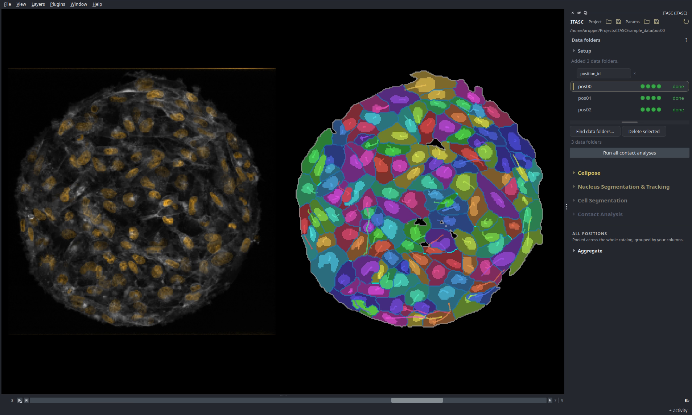

# ITASC

Segment, track, correct, and quantify cells in time-lapse microscopy, inside napari.

ITASC (Interactive Tracking And Segmentation of Cells) is a
[napari](https://napari.org) plugin. It takes a time-lapse of a cell monolayer
and returns, for every cell, an outline and an identity that hold across the
whole recording: its shape in each frame, and the fact that it is the same cell
from the first frame to the last. From that it measures which cells touch and
when neighbors swap.

The monolayers it is built for are dense and highly motile, and that is where
automatic methods break down. Cells are packed with no clear gap between them,
and they travel far between frames, sliding past one another. So the outlines
come out wrong, they come out wrong in a different way in each frame, and the
tracks built on them break. One broken track spoils every measurement that
follows.

ITASC answers this in two parts. It does segmentation and tracking together
rather than one after the other, choosing the outlines and the links across the
whole recording in one calculation, so the outline it settles on is also the one
that tracks correctly. It then hands the result to a person, offering the
alternatives the solver already considered as one-click fixes. The effort a
monolayer needs is spent once, at the point of correction, and carried through
to the numbers. [How ITASC
works](https://arturruppel.github.io/ITASC/explanation/index.html) sets out the
problem and the idea in full.

<!-- hero-start -->

  

<!-- hero-end -->

## What it does

The full ITASC app moves through four stages. Each writes its result to a project
folder on disk, and the next stage reads it back, so the folder is the source of
truth and a run can be inspected or resumed between any two stages.

- **Segment.** [Cellpose-SAM](https://github.com/MouseLand/cellpose) finds the
  cells. On sparse, well-separated cells its outlines are the answer. On a dense
  monolayer they are not, so ITASC keeps its raw output instead and reduces it to
  two maps: where the cells are, and where their boundaries run. Every later
  stage reads those maps, never the raw stack.
- **Track.** [Ultrack](https://github.com/royerlab/ultrack) builds many candidate
  outlines per frame and selects the set that is most consistent in time, solving
  the outlines and the links at once. That is what a dense monolayer needs.
  Sparse cells do not need it, and [LapTrack](https://github.com/yfukai/laptrack)
  links them frame to frame instead.
- **Correct.** No solver is perfect on dense, dividing cells, so a person fixes
  what it missed, with tools adapted from
  [EpiCure](https://github.com/Image-Analysis-Hub/Epicure). The candidates the
  tracker already built are offered as selectable alternatives, so most fixes are
  a click rather than a redraw.
- **Quantify.** Per position: which cells touch, the edges they share, and the T1
  events where two neighbors swap partners, written to one self-describing HDF5
  (`.h5`) file. Across the project: the shape and dynamics of nuclei, cell
  bodies, and contacts over time, pooled into `.csv` tables.

ITASC also ships as smaller napari tools, each one a slice of that pipeline, for
when the full app is more than the job needs. Pick the row that matches the data
you have; each links to that tool's guide, which covers installing and using it.

| If you have… | Reach for | It gives you |
| --- | --- | --- |
| **Dense, motile cells of varying shape** (a confluent monolayer), from raw stacks to quantified contacts | [itasc\[all\]](https://arturruppel.github.io/ITASC/manual/full-app.html) | The unified `ITASC` workflow widget, every stage end to end. |
| **Sparse, well-separated cells** with a cell and/or nucleus marker, to segment and track one or both channels | [itasc-cellpose](https://arturruppel.github.io/ITASC/manual/cellpose.html) | A local Cellpose-SAM runner for segmentation, then `laptrack` linking across time, plus manual correction of tracks and masks (adapted from [EpiCure](https://github.com/Image-Analysis-Hub/Epicure)). One channel or two. |
| **Foreground and contour maps already**, to skip the cellpose step | [itasc-tracking](https://arturruppel.github.io/ITASC/manual/tracking.html) | Ultrack candidate database, solving, browsing, and interactive segmentation and tracking correction. |
| **Tracked labels for a set of positions** (cell and/or nucleus), to quantify and pool them | [itasc-aggregate](https://arturruppel.github.io/ITASC/manual/aggregate.html) | Contact analysis per position (cell-cell edges, border edges, T1 events to HDF5), then aggregate quantification pooled across the project to `.csv`. Partial data is fine. |
| **Code to build on** | [itasc-core](https://arturruppel.github.io/ITASC/manual/core.html) | TIFF/path/label-IO helpers, the lineage model, and napari UI primitives. |

## Built on

ITASC reuses the published methods of four tools. If you use the stage that
depends on one, please cite it:

- **Cellpose-SAM** (segmentation): Pachitariu M, Rariden M, Stringer C.
  *Cellpose-SAM: superhuman generalization for cellular segmentation.* bioRxiv
  (2025). [doi:10.1101/2025.04.28.651001](https://doi.org/10.1101/2025.04.28.651001)
  · [MouseLand/cellpose](https://github.com/MouseLand/cellpose)
- **Ultrack** (dense tracking): Bragantini J, et al. *Ultrack: pushing the
  limits of cell tracking across biological scales.* Nature Methods (2025).
  [doi:10.1038/s41592-025-02778-0](https://doi.org/10.1038/s41592-025-02778-0)
  · [royerlab/ultrack](https://github.com/royerlab/ultrack)
- **LapTrack** (sparse tracking): Fukai YT, Kawaguchi K. *LapTrack: linear
  assignment particle tracking with tunable metrics.* Bioinformatics 39(1),
  btac799 (2023). [doi:10.1093/bioinformatics/btac799](https://doi.org/10.1093/bioinformatics/btac799)
  · [yfukai/laptrack](https://github.com/yfukai/laptrack)
- **EpiCure** (correction tools): Letort G. *EpiCure: a versatile and handy tool
  for curation of epithelial segmentation.* bioRxiv (2026).
  [doi:10.64898/2026.03.27.714683](https://doi.org/10.64898/2026.03.27.714683)
  · [Image-Analysis-Hub/Epicure](https://github.com/Image-Analysis-Hub/Epicure)

<!-- docs-nav-start -->
## Documentation

- [User guide](https://arturruppel.github.io/ITASC/): install, the staged workflow, and driving the
  plugin.
- [API reference](https://arturruppel.github.io/ITASC/api/index.html): the programmatic API, generated
  from the source.
<!-- docs-nav-end -->

## Status

ITASC is approaching its first public release and JOSS submission. The four
stages and the file-based project layout are settled and in active research use.
Installation and the public API are close to final: expect small changes before
the release and its accompanying manuscript.

## Contributing and support

Bug reports, questions, and pull requests are welcome. Open an
[issue](https://github.com/ArturRuppel/ITASC/issues) to report a problem or ask a
usage question (label it `question`), and see
[`CONTRIBUTING.md`](https://github.com/ArturRuppel/ITASC/blob/main/CONTRIBUTING.md)
for how to set up a development environment and send a change. For
pre-publication or scientific questions, contact Artur Ruppel at
`artur@ruppel.pro`.

## Citing ITASC

Cite the software using the metadata in [`CITATION.cff`](https://github.com/ArturRuppel/ITASC/blob/main/CITATION.cff). A DOI
and manuscript citation will be added with the public release. For
pre-publication citation questions, contact Artur Ruppel at `artur@ruppel.pro`.

## License

AGPL-3.0. See [`LICENSE`](https://github.com/ArturRuppel/ITASC/blob/main/LICENSE).

## AI usage

Generative AI tools (OpenAI GPT and Anthropic Claude) assisted with code
drafting, refactoring, tests, debugging, and documentation. Human authors made
the scientific, architectural, and design decisions, and are fully responsible
for all code and other content in the repository.
