# CellFlow Dataflow

```mermaid
flowchart LR
    classDef data fill:#a9d4ef,stroke:#111,stroke-width:1px,color:#111;
    classDef file fill:#92e193,stroke:#111,stroke-width:1px,color:#111;
    classDef external fill:#e8e8e8,stroke:#111,stroke-width:1px,color:#111;

    RawSource["NDTiff Dataset<br/>position, time, z, channel<br/>CSU642 nucleus<br/>CSU488 cell membrane<br/>CSU561 NLS"]:::file

    PrepData["Data Preparation<br/>cellflow.core.data_prep.run<br/><br/>z-shift correction<br/>XY downsample<br/>z-average + 3D+t export"]:::data
    NucleusInput["posNN/0_input/<br/>nucleus_zavg.tif<br/>nucleus_3dt.tif"]:::file
    CellInput["posNN/0_input/<br/>cell_zavg.tif<br/>cell_3dt.tif"]:::file
    NLSInput["posNN/0_input/<br/>NLS_zavg.tif<br/>NLS_3dt.tif"]:::file
    PrepMetadata["posNN/0_input/<br/>z_shift.csv<br/>run_params.json"]:::file

    Cellpose["External Cellpose Pipeline<br/>cellflow.napari.hpc_cellpose_widget<br/><br/>nucleus and cell probability maps<br/>flow vectors"]:::external
    NucleusCellpose["posNN/1_cellpose/<br/>nucleus_prob_3dt.tif<br/>nucleus_dp_3dt.tif<br/>nucleus_prob_zavg.tif"]:::file
    CellCellpose["posNN/1_cellpose/<br/>cell_prob_3dt.tif<br/>cell_dp_3dt.tif<br/>cell_prob_zavg.tif"]:::file

    NucleusContour["Nucleus Contour Maps<br/>cellflow.segmentation<br/>build_consensus_boundary<br/>compute_filtered_contour_maps"]:::data
    NucleusContours["posNN/2_nucleus/<br/>contour_maps.tif<br/>foreground_scores.tif<br/>foreground_masks.tif<br/>source_labels/*.tif"]:::file

    UltrackDb["Ultrack DB Generation<br/>cellflow.tracking_ultrack.db_build<br/><br/>segment candidates<br/>inject validated nodes optional<br/>score nodes<br/>link candidates"]:::data
    UltrackDbFile["posNN/2_nucleus/ultrack_workdir/<br/>data.db"]:::file

    UltrackSolve["Ultrack Solve + Export<br/>run_solve<br/>export_tracked_labels"]:::data
    InitialNucleusLabels["posNN/2_nucleus/<br/>tracked_labels.tif"]:::file

    Correction["Manual Correction / Validation<br/>napari correction widget<br/>greedy tracker<br/>extend / retrack"]:::data
    CorrectedNucleusLabels["posNN/2_nucleus/<br/>tracked_labels.tif<br/>(corrected)"]:::file

    CellFlow["Cell Workflow<br/>compute_filtered_flow_vectors<br/>compute_cellpose_foreground_masks<br/>compute_flow_following_movie"]:::data
    CellFlowFields["posNN/3_cell/<br/>filtered_dp.tif<br/>filtered_flow_mag.tif"]:::file
    CellForeground["posNN/3_cell/<br/>foreground_masks.tif"]:::file
    CellLabels["posNN/3_cell/<br/>tracked_labels.tif"]:::file

    Analysis["Position Analysis"]:::data
    AnalysisFile["posNN/4_analysis/<br/>position_analysis.h5"]:::file

    NLSClass["NLS Classification"]:::data
    Meta["Meta Analyzer"]:::data
    MetaFiles["catalog.csv<br/>cross-position H5 records"]:::file

    RawSource --> PrepData
    PrepData --> NucleusInput
    PrepData --> CellInput
    PrepData --> NLSInput
    PrepData --> PrepMetadata

    NucleusInput --> Cellpose
    CellInput --> Cellpose
    Cellpose --> NucleusCellpose
    Cellpose --> CellCellpose

    NucleusCellpose --> NucleusContour
    NucleusContour --> NucleusContours

    NucleusContours --> UltrackDb
    NucleusCellpose --> UltrackDb
    UltrackDb --> UltrackDbFile

    UltrackDbFile --> UltrackSolve
    UltrackSolve --> InitialNucleusLabels

    UltrackDbFile --> Correction
    InitialNucleusLabels --> Correction
    Correction --> CorrectedNucleusLabels

    CellCellpose --> CellFlow
    CorrectedNucleusLabels --> CellFlow
    CellFlow --> CellFlowFields
    CellFlow --> CellForeground
    CellFlow --> CellLabels

    CorrectedNucleusLabels --> Analysis
    CellLabels --> Analysis
    Analysis --> AnalysisFile

    NLSInput --> NLSClass
    CorrectedNucleusLabels --> NLSClass
    AnalysisFile --> NLSClass
    NLSClass --> AnalysisFile

    AnalysisFile --> Meta
    CorrectedNucleusLabels --> Meta
    CellLabels --> Meta
    Meta --> MetaFiles
```

## Active Entry Points

- napari plugin: `src/cellflow/napari.yaml`
- main workflow UI: `src/cellflow/napari/main_widget.py`
- data prep backend: `src/cellflow/core/data_prep.py`
- nucleus tracking backend: `src/cellflow/tracking_ultrack/`
- cell segmentation backend: `src/cellflow/segmentation/flow_following.py`
- analysis backend: `src/cellflow/analysis/position_artifact.py`
- NLS classification CLI: `cellflow-classify-nls`
