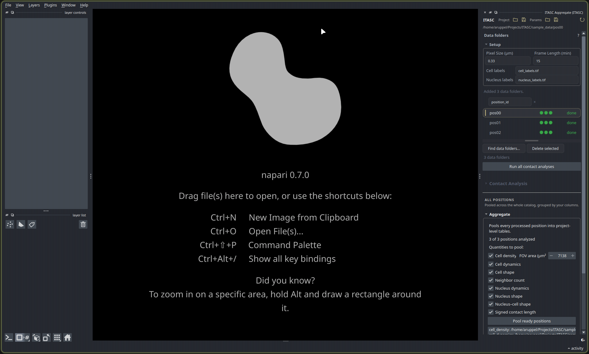

# itasc-aggregate

The last two stages of the pipeline on their own: measure the contacts in one
position, then pool the results across a project. It reads the tracked cell and
nucleus labels a run already committed and turns them into the contact graph, the
shared edges between neighbors, the T1 events where neighbors swap partners, and
the project-level tables that pool all of it.

This is the full app with its middle removed. Segmentation and tracking are gone;
what remains is the loop around them: finding the position folders, running contact
analysis on each, and aggregating across the project. Those parts work exactly as
they do in the full app, so its
[full-app guide](https://arturruppel.github.io/ITASC/manual/full-app.html) is the
explanation: read it for [contact analysis](https://arturruppel.github.io/ITASC/manual/full-app.html#stage-4-contact-analysis)
and [aggregation](https://arturruppel.github.io/ITASC/manual/full-app.html#aggregate-across-positions).



*The **ITASC Aggregate** panel. **Find data folders** discovered three positions,
each with a green status rail; **Aggregate** below pools the ticked quantities into
one table per quantity.*

## What it needs

Point **Find data folders** at a parent directory, and it lists every position
below it that holds a committed `cell_labels.tif` (a `nucleus_labels.tif` is used
too when present). Each position gets a status rail: **click a dot to load that
stage's output into the viewer**. Select a position to run or re-run its contact
analysis, then **Pool ready positions** writes the project-level tables, one CSV
per quantity, to the project root.

## Install

```bash
pip install itasc-aggregate
```

To run it as a napari app instead of installing into your own environment, the
[install guide](https://arturruppel.github.io/ITASC/manual/install.html) sets up
napari and the tool together.

## For scripting

The headless backend lives under `itasc.contact_analysis`, Qt-free and importable
without the full app:

```python
from itasc.contact_analysis import ensure_contacts, discover_contact_batch_jobs, run_contact_batch

# One position (build only if missing):
ensure_contacts("cells.tif", nucleus_labels_path=None, output_path="contact_analysis.h5")

# A whole study, discovered by folder:
jobs = discover_contact_batch_jobs("/data/study", cell_name="cell_labels.tif")
run_contact_batch(jobs, overwrite=False)
```

The output is one self-describing HDF5 file per position, holding `cells`, `edges`,
`t1_events`, and `provenance`. The
[full-app guide](https://arturruppel.github.io/ITASC/manual/full-app.html) covers the
pipeline these stages sit at the end of.
