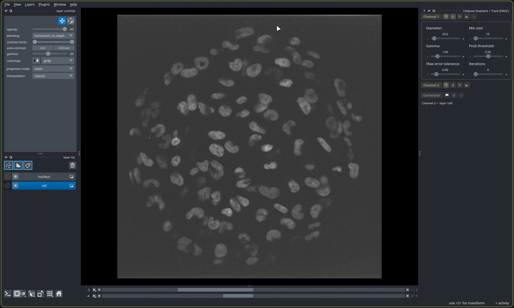
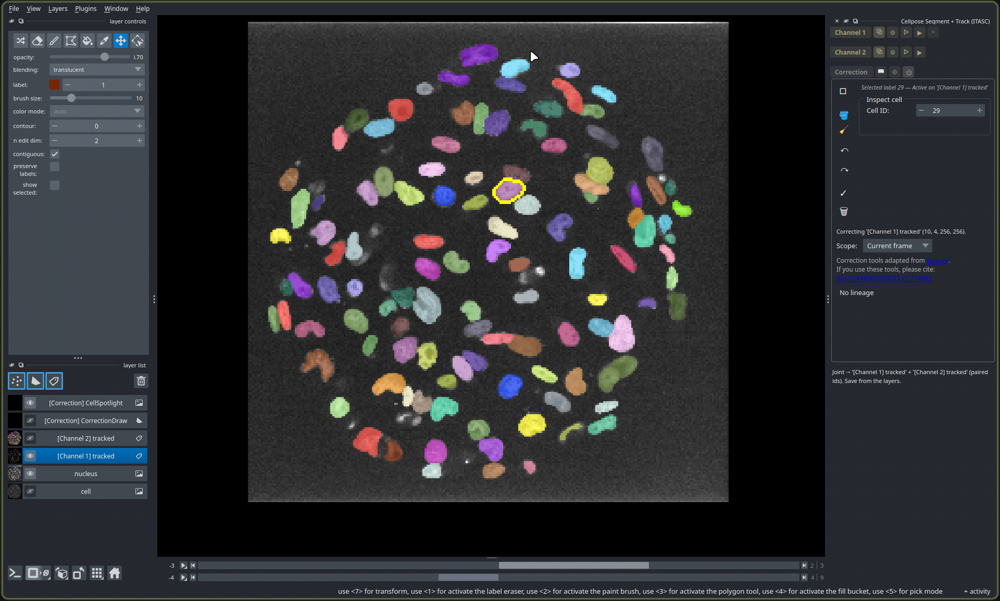

# itasc-cellpose

`itasc-cellpose` is the Cellpose stage on its own, run inside the napari viewer.
Bind it to an image, get tracked labels back, correct them, and keep what you
want. Reach for it when you already have a stack open and want
[Cellpose](https://github.com/MouseLand/cellpose) masks and time tracks without
the full pipeline's project folder.

That absence is the main difference from the full `itasc[all]` app, which works
through a folder on disk, each stage reading and writing files. This tool touches
no folder: a run leaves its results in the viewer, and nothing is saved unless you
choose to.



*The **Cellpose Segment + Track** panel, with the open `nucleus` and `cell` images
bound to its two channels. The controls above tune the segmentation.*

## One channel or two

With one channel, Cellpose finds the objects in each frame and links them across
time into tracks with [`laptrack`](https://github.com/yfukai/laptrack). The shapes
are Cellpose's own, drawn directly; the full app stops a step earlier and builds
its shapes another way.

With a second channel, the two are read together, so the first helps Cellpose find
the objects in the second: a nucleus channel makes the cell bodies come out much
cleaner. Each object in the second channel is matched to one in the first and
inherits its track, so a cell carries the identity of the nucleus inside it. By
convention the first channel is the nucleus and the second the cell, though the
tool does not require it.



*A finished two-channel run. The tracked `[Channel 1]` and `[Channel 2]` labels sit
above the `nucleus` and `cell` inputs; the **Correction** panel below edits
whichever labels are active. Nothing is saved until you save the layers.*

## Running it

To try it before you have data of your own, open the `nucleus` and `cell` stacks
from the repository's
[`sample_data/`](https://github.com/ArturRuppel/ITASC/tree/main/sample_data)
folder (any `posNN/0_input/`) and bind them as the two channels. The stacks ship
with the source, not the installed package, so download them from there.

Select an image in the viewer and bind it to a channel with the channel's bind
button; there is no file to open. **Preview** (▷) tries the current frame so you
can adjust the controls before committing; it also shows the probability and flow
maps Cellpose works from. **Segment** (▶) runs the whole stack, and **Track** (⊳)
links the objects across time. Bind a second channel to read the two together.

The results arrive as label layers. Correct any mistakes in the panel below, then
save the layers you want with **File → Save Selected Layers**.

## Correcting labels

The **Correction** panel edits whichever label layer is active, in place. Its tools
are adapted from [EpiCure](https://github.com/Image-Analysis-Hub/Epicure):

- **Select** a cell with left-click, **spawn** one with middle-click on empty
  space, **erase** one with middle-click (or `Delete`).
- **Merge** two cells with `Ctrl`+left, **draw or split** with `Shift`+left or
  right-drag.
- **Swap or attach to a track** with `Ctrl`+right, **grow or link the selected
  track** with `Ctrl`+middle.
- **Retrack** from the current frame outward: `E` forward, `Q` backward.
- Fill holes, clear stranded fragments, and `Ctrl+Z` to undo.

Save the corrected layer with **File → Save Selected Layers**.

## Install

```bash
pip install "itasc-cellpose[cellpose,laptrack]"
```

The `[cellpose]` extra adds the Cellpose-SAM model (`cellpose`, `torch`,
`torchvision`), `[laptrack]` adds the time tracker; both are imported lazily, so
`import itasc.cellpose` works without them. To run it as a napari app instead of
installing into your own environment, the
[install guide](https://arturruppel.github.io/ITASC/manual/install.html) sets up
napari and the tool together.

## Scripting

The rest of this page is reference for scripting the tool; skip it if you only
drive the widget. Everything the widget does is available headless and Qt-free
under `itasc.cellpose`:

```python
import tifffile
from itasc.cellpose import cellpose_runner, native_masks, track_laptrack

stack = cellpose_runner.to_tzyx(tifffile.imread("cell.tif"), "2D+t")
params = cellpose_runner.CellParams(diameter=0.0, min_size=0, gamma=1.0)
masks = native_masks.run_cell_masks_stack(stack, params)       # (T, Z, Y, X)
tracked = track_laptrack.track_masks(masks, max_distance=15.0)  # tracked labels
```

**Input** is any 2-D to 4-D image layer per channel, bound from the active layer;
there is no file loading and no layout to declare. Every plane is segmented
individually; for tracking the shorter leading axis is read as `Z`, the longer as
time. Channel 1 is required, Channel 2 optional. **Output** is napari layers, not
files: `int32` Labels layers tagged `[Channel 1]` and `[Channel 2]`, saved with
napari's *Save Selected Layers*.

> The integrated ITASC app reuses this distribution's Cellpose runner for its own
> in-app stage; those modules ship here and are imported by the orchestrator. This
> document covers the standalone napari tool.
