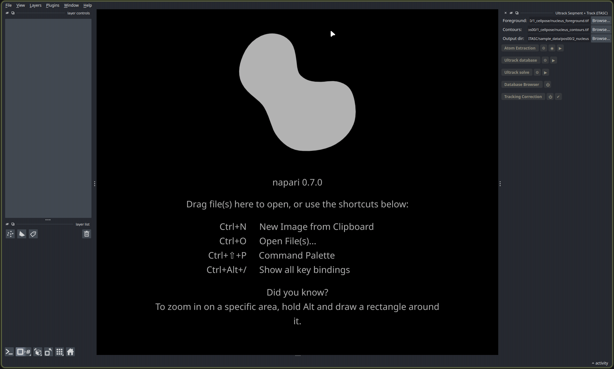

# itasc-tracking

The nucleus tracking stage on its own, run inside the napari viewer. It takes the
foreground and contour maps Cellpose produced and turns them into tracked,
correctable nucleus labels, using the [Ultrack](https://github.com/royerlab/ultrack)
solver. Reach for it when you already have those maps and want tracks without the
full pipeline's project folder.

This is [Stage 2 of the full app](https://arturruppel.github.io/ITASC/manual/full-app.html#stage-2-nucleus-segmentation-and-tracking),
lifted out on its own. Everything it does, from atom extraction through the solve
to the correction pass, works exactly as it does there, so that page is the
explanation: read it for what each button does and how to correct the tracks.



*The **Ultrack Segment + Track** panel. The three fields point it at the two input
maps and the folder for its results; the buttons below run the stages top to bottom.*

## The one difference

The full app reads and writes through a project folder, one position at a time.
This tool takes files instead: point **Foreground** at the foreground map, **Contours**
at the contour map, and **Output dir** at a folder for the results (it defaults to the
foreground file's folder). The two inputs can have any name and live anywhere. Run the
stages top to bottom, correct the tracks, and the results land in the output folder.

## Install

```bash
pip install "itasc-tracking[solve]"
```

The `[solve]` extra adds the Ultrack solver, imported only when you build the database
or solve; correction-only use does not need it. To run it as a napari app instead of
installing into your own environment, the
[install guide](https://arturruppel.github.io/ITASC/manual/install.html) sets up napari
and the tool together.

## For scripting

The headless backend lives under `itasc.tracking_ultrack` (atoms, database, linking,
solving, export, correction) and `itasc.correction` (label edits), Qt-free and importable
without the full app. The
[full-app guide](https://arturruppel.github.io/ITASC/manual/full-app.html) covers the
pipeline this stage sits in.
